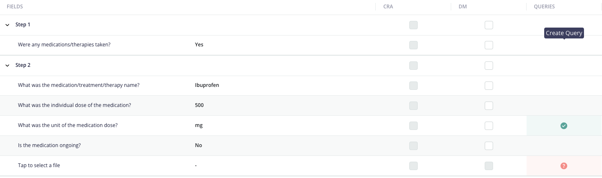
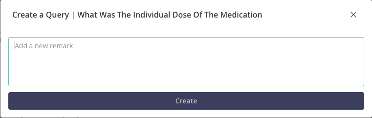
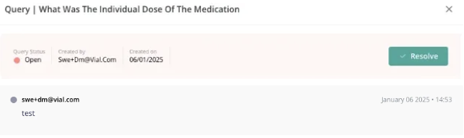
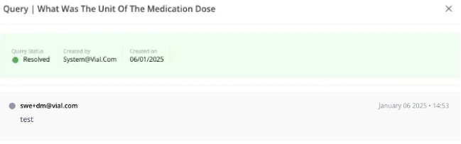

# take-home-assignment-A

## Getting Started
- copy the .env.example file into a .env file
- `docker-compose build`
- `docker-compose up`
- `npm run migrate`
- `npm run seed`
- if you view your database, you should be able to see a populated form data table
- running the following in your terminal will perform a GET request to fetch the form data
```bash
curl --location 'http://127.0.0.1:8080/form-data' --header 'Content-Type: application/json'
```

## Introduction
The purpose of this project is to evaluate your full stack web development skills with an example project that closely resembles your day to day tasks at Vial. 

You will build a simple **Query Management Application** where users can create queries. Each query will have a title, description, date, and a status (OPEN, RESOLVED). The application will consist of a simple frontend (UI), a backend API, and a database to persist the query data.

Queries in the context of an EDC (electronic data capture) system help identify and flag incorrect data entries for patients and alert effected data managers/ users when a query needs to be resolved.

**NOTE: Images provided in the assignment are just examples, and the frontend does not need to look the same as the provided mock. Be creative with your design!**

- for example some images show the username information, this is not required to submit the assignment

Some helpful links:

- https://medrio.com/blog/query-management-in-clinical-trials/
- [https://www.biopharmaservices.com/blog/data-cleaning-and-query-management-importance-in-edc/#:~:text=Query management is essential for,risk of regulatory non-compliance](https://www.biopharmaservices.com/blog/data-cleaning-and-query-management-importance-in-edc/#:~:text=Query%20management%20is%20essential%20for,risk%20of%20regulatory%20non%2Dcompliance)

## Preferred workflow
* Fork the repository
* Create as many commits as needed, with the corresponding descriptive message/description

## Tech stack
* [Node](https://nodejs.org/en/)
* [Typescript](www.google.com)
* [Fastify](https://www.fastify.io/)
* [Prisma ORM](https://www.prisma.io/)
* [PostgreSQL](https://www.postgresql.org/)
* [Docker and Compose](https://www.docker.com/)

### Requirements

1. **Frontend (UI)**:
    - Use TypeScript / React / Next.js to build a single-page web application
    - Implement a table view to display data that can be queried (for example below)
        
        
        
        - the key here is to implement a view that contains
            - **Question Column**
            - **Answer Column**
            - **Queries Column**
                - the User should be able to hover over this column and “Create Query” if no query exists (e.g. the data does not have a query associated with it)
                    - a “+” icon should be displayed with a tooltip “Create Query”
                - otherwise the query is either
                    - “OPEN” - Red Status with question mark icon
                    - “RESOLVED” - Green Status with checkmark icon
        - the table view is fetched from the form-data endpoint
    - User should be able to add a new query using the “Create Query” button which opens a modal like below:
        
        
        
        - User should be able to edit the description textbox and submit the form
        - This data should then be saved in the backend
            - Payload information
                - Title (based on the **question** of clicked on data, e.g. “What was the Individual Dose of the Medication”)
                - Description (from user input)
                - form data id
    - If the User is viewing a query that already exists and has a status “OPEN”
        
        
        
        - User should view something similar to this indicating that the query status is open
        - User should see what the description of the query is
        - User should see a button to “Resolve” this query
            - when “resolve” button is clicked the api should send a request to the backend to update the query status to “RESOLVED”
    - User should be able to view a “resolved” query
        
        
        
        - should clearly indicate that the query is resolved
        - should clearly display the description text of the query
        - should clearly display the date the query was created or updated
2. **Backend (API)**:
    - Build a **RESTful API for the queries**, a simple application skeleton is provided for the BE with seed data for the form data
    - The backend should just be extending the existing application given the technologies (node.js, prisma, and seed data)
    - Submissions that don't build upon the existing application will be immediately rejected
    - Feel free to include additional technologies/libraries as you see fit to complete the application
    - Including tests is optional but recommended
    - The API should have the following endpoints:
        - ENDPOINT 1: Retrieve a list of all form data and related query data.
          - the list endpoint is already implemented but you will have to include the query relation
        - ENDPOINT 2: Create a new query.
        - ENDPOINT 3: Update an existing query by ID.
        - (BONUS ENDPOINT): Delete a query by ID.
3. **Database**:
    - (Given) The **form data model** should have the following fields:
      - `id`: Unique identifier (auto-increment or UUID).
      - `question`: String, required
      - `answer`: String, required
    - The **query model** should have the following fields:
        - `id`: Unique identifier (auto-increment or UUID).
        - `title`: String, required.
        - `description`: String, optional.
        - `createdAt`: Date or string (ISO format), required.
            - Indicates when the query was created.
        - `updatedAt`: Date or string (ISO format), required.
            - Indicates when the query was last updated.
        - `status`: String, possible values (OPEN, RESOLVED).
        - `formData`: relational field to a formData
        - `formDataId`: the relational foreign key id of the formData

### Guidelines

- **Tech Stack**: The frontend application should be built using TypeScript/React/Next.js with Mantine as a suggested UI library. The backend application should be built using the existing provided skeleton (Node.js, TypeScript, Prisma, PSQL).
- **Code Quality**: Please ensure your code is clean, well-organized, and well-documented. Add comments where necessary to explain key decisions.
- **Time Management**: This is intended to be a 4+ hour assignment. Focus on getting the basic functionality working first, and add optional features if you have time.
- **(OPTIONAL) API Documentation**: Provide basic API documentation (e.g., using Swagger or in README.md).
- **(OPTIONAL) Deployment**: If possible, deploy your application to a service like Heroku, Vercel, or Netlify, and share the live URL with us for bonus points!

### Submission Instructions

- Share a GitHub repository with your code and provide instructions for how to run the project locally.
- (OPTIONAL) If you deploy the application, include the live link in the repository’s README.
- Ensure that your submission includes clear documentation on how to set up and run the backend and frontend.

---

We hope you have fun with the assignment and we look forward to hearing from you!
